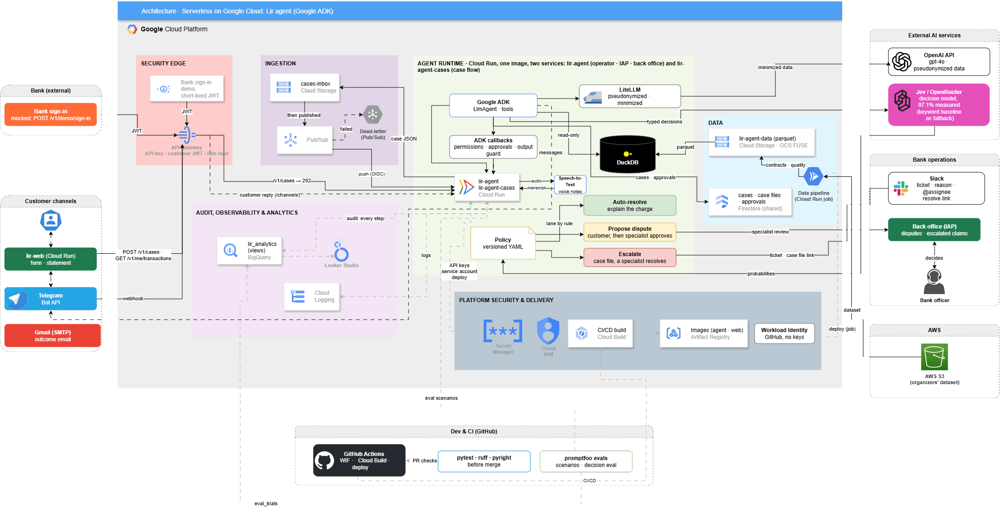

# Clir Agent

Factored AI & Data Hackathon 2026 entry: a banking customer-service agent for the
synthetic LATAM Bank dataset (v1.0.0).

The data analysis shows that complaints are the contact reason with the most
unresolved contacts, and that charge disputes are the largest block of formal
claims (PQR). The product proposal ("No reconozco este cargo") has the agent
handle that flow for a signed-in bank customer, in Spanish and Portuguese. It
finds the charge, explains it with verifiable evidence, opens a dispute only
when it is eligible, or hands off to a human. The LLM converses, a fast
decision layer (Jev) classifies, and deterministic code authorizes. The
proposal is still marked "to be decided by the team"; the agent app currently
implements only the first building blocks (authenticated session and a
customer-profile tool).

## Architecture



Target architecture: a serverless agent on Google Cloud, triggered by events
rather than a chat front end. Services inside the blue box run on Google Cloud;
everything outside is an external system or provider.

| Zone | Services | Role |
|---|---|---|
| Security edge | Identity Platform, API Gateway | Validates the JWT issued after the bank's biometric check (mocked), rate limits, verifies channel webhook signatures |
| Ingestion | Cloud Storage (`cases-inbox`), Pub/Sub, dead-letter topic | Stores each incoming case, triggers the agent, buffers spikes and retries failures |
| Agent runtime | Cloud Run `lir-agent` (Google ADK, LiteLLM, ADK callbacks, policy, DuckDB) | One service with three routes: `/v1/cases`, `/pubsub/push`, `/channels` |
| Data | Data pipeline (Cloud Run job), Cloud Storage (`lir-curated`), Firestore | Curated parquet read by the tools; cases and handoffs written and read back |
| Audit, observability & analytics | BigQuery (`lir_audit`), Looker Studio, Cloud Logging, Trace, Monitoring | Audit receipt for every step, dashboards and alerts |
| Platform security & delivery | Secret Manager, Cloud IAM, Cloud Build, Artifact Registry, billing budgets | Keys, least-privilege service accounts, build and deploy, spend alerts |

How a case flows:

1. The bank's chatbot verifies the customer (biometric KYC, mocked) and calls
   `POST /v1/cases` with a JWT through API Gateway.
2. `lir-agent` stores the case in Cloud Storage and returns `202`; the storage
   notification publishes to Pub/Sub, which pushes the case back to the agent.
3. The agent talks to the customer over WhatsApp (mocked) or Telegram in
   Spanish or Portuguese. Jev returns typed decisions with calibrated
   probabilities, and a versioned policy in code assigns the lane:
   auto-resolve (explain the charge or open a verified dispute, never a
   refund), propose, or escalate.
4. Proposals and escalations reach a bank officer in Slack with the case file.
   Every step is written to the audit log in BigQuery.

The LLM (OpenAI through LiteLLM, swappable by configuration) only receives
minimized data: opaque transaction references and an allowlist of fields.

## Repository structure

```
.
├── app/Agent/    # Python agent (Google ADK + LiteLLM), managed with uv
├── data/         # Data lake, pipeline (raw -> staging -> curated), contracts, reports
├── docs/         # Product proposal and architecture diagram (docs/architecture/)
└── .githooks/    # Git hooks: secret scan on commit, no direct push to main
```

## Data pipeline (`data/`)

Layered flow where each layer is regenerated from the previous one with
versioned code. Stages, as wired in `data/pipelines/__main__.py`:

| Stage | Module | Output |
|---|---|---|
| Ingest (optional, `--ingest`) | `pipelines/ingest.py` | S3 to `raw/` + `manifests/ingest/` |
| Staging | `pipelines/staging.py` | `staging/` (typed Parquet) + `manifests/staging/` |
| Quality | `pipelines/quality.py` | `reports/data_quality.md` + `manifests/quality/` |
| Curated | `pipelines/curated.py` | `curated/` + `manifests/curated/` |
| Insights | `pipelines/insights.py` (calls `figures.py`) | `reports/insights.md` + `reports/figures/*.png` |

Install and run (from `data/README.md`; the venv activation shown there is for
Windows Git Bash):

```bash
cd data
python -m venv .venv && source .venv/Scripts/activate
pip install -r requirements.txt
cp .env.example .env              # fill in the S3 credentials; never commit .env

python -m pipelines --ingest      # full run, downloads from S3 first (~4 min)
python -m pipelines               # skips the download (~1.5 min)
```

- `.env` variable names: `AWS_ACCESS_KEY_ID`, `AWS_SECRET_ACCESS_KEY`, `AWS_DEFAULT_REGION`.
- `raw/`, `staging/`, `curated/` and `samples/` are gitignored; `contracts/`,
  `manifests/`, `knowledge_base/`, `eval/`, `fixtures/` and `reports/` are versioned.
- Contracts live in `data/contracts/`: one `<table>.yaml` schema per table
  (customers, products, transactions, complaints, call_center_interactions,
  call_transcripts, digital_events, and others), plus `relationships.yaml` (FKs),
  `glossary.yaml` (value mappings and business definitions),
  `quality_rules.yaml` (rules, thresholds, owners) and `CHANGELOG.md`.
- Rules for agents working in `data/` (raw is read-only, no raw rows to external
  model APIs, reports are generated, never hand-edited) are in `data/AGENTS.md`.

## Agent app (`app/Agent/`)

- **Stack:** Python >= 3.13 (`.python-version` is 3.13), [uv](https://docs.astral.sh/uv/),
  Google ADK (`google-adk`), LiteLLM, DuckDB, pydantic-settings. Dev tools: pytest,
  pytest-cov, pyright, ruff.
- **Model backend:** any LiteLLM-supported provider, selected through
  `LLM_MODEL` and `LLM_API_BASE`.
- **Data:** the customer tool reads `staging/customers.parquet` from the data
  lake (default `data/` at the repo root), so run the pipeline first.
- **Hardening:** an authentication guardrail refuses sessions without a signed-in
  customer, the customer ID lives in session state (never in the conversation),
  and the model only sees an allowlist of customer fields.

Configure:

```bash
cd app/Agent
cp .env.example .env
uv sync
```

Settings names (from `src/Agent/config.py`; see `.env.example`): `ENVIRONMENT`
(`local`, `staging`, `production`), `LOG_LEVEL`, `LLM_MODEL`, `LLM_API_BASE`,
`LLM_API_KEY` (optional, hosted providers only), `DATA_DIR`.

Run and test (from `app/Agent/`, per its README):

```bash
uv run Agent                       # print the resolved configuration
uv run chat --customer-id <ID>     # terminal chat; type "chao pescao" to exit
uv run adk run src/Agent/agent     # ADK terminal chat
uv run adk web src/Agent           # ADK browser dev UI
uv run pytest                      # tests
uv run ruff check .                # lint
uv run pyright                     # type check
```

`--customer-id` is required by `chat.py` and stands in for real authentication.

## Git hooks

Enable once per clone:

```bash
git config core.hooksPath .githooks
```

- `pre-commit`: scans staged changes with [gitleaks](https://github.com/gitleaks/gitleaks)
  and blocks the commit if a secret is found or gitleaks is not installed.
- `pre-push`: blocks pushes to `main`; push a feature branch and open a PR.
- `.claude/hooks/guard-push.sh` is a Claude Code `PreToolUse` hook script that
  denies `git push` commands targeting `main` (or run from the `main` branch).

## Documentation

- [`data/README.md`](data/README.md): data layers, provenance, declared vs observed quality, leakage rules (Spanish)
- [`data/AGENTS.md`](data/AGENTS.md): rules for agents working in `data/`
- [`app/Agent/README.md`](app/Agent/README.md): agent setup, commands, dependencies
- [`docs/propuesta-opcion-1-disputas.md`](docs/propuesta-opcion-1-disputas.md): product proposal (Spanish)
- [`data/reports/insights.md`](data/reports/insights.md): evidence for choosing the workflow
- [`data/reports/data_quality.md`](data/reports/data_quality.md): data-quality scorecard
