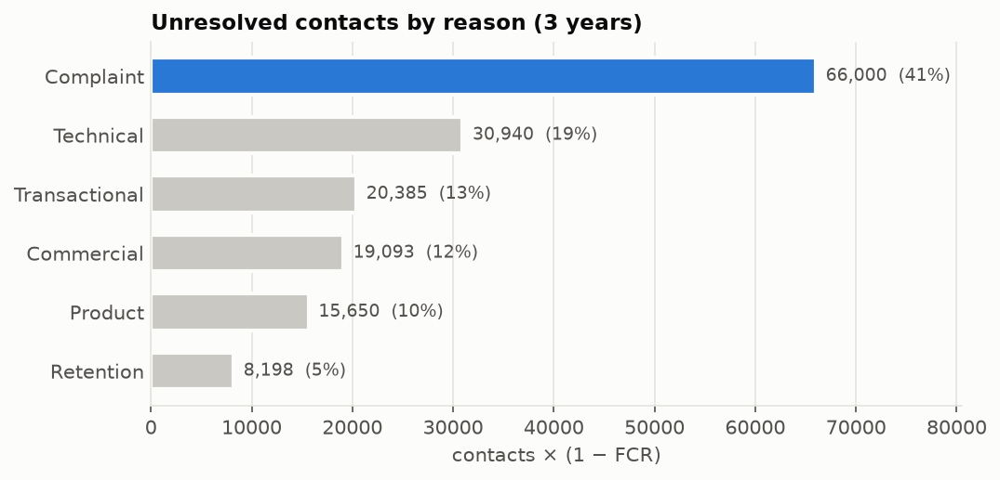
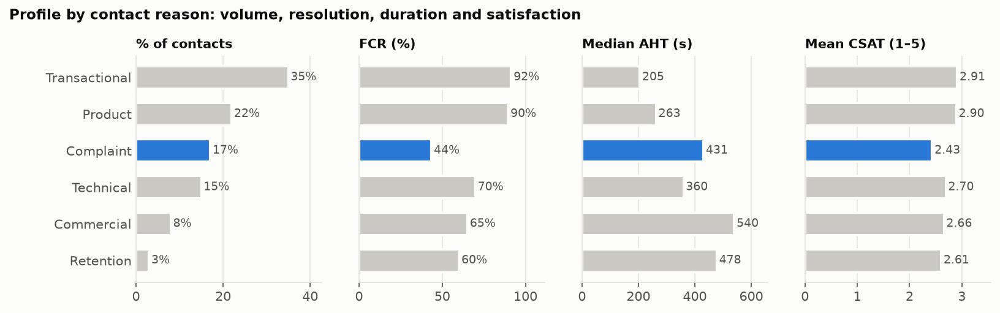
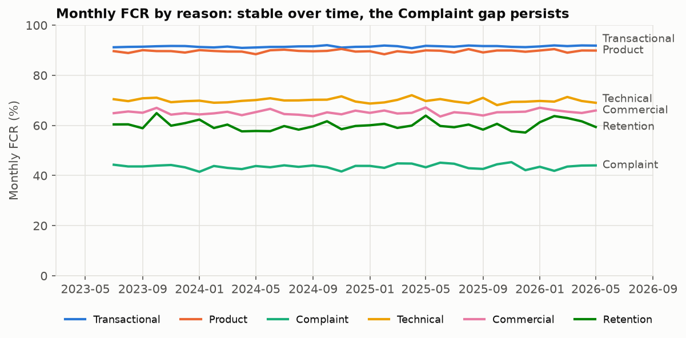
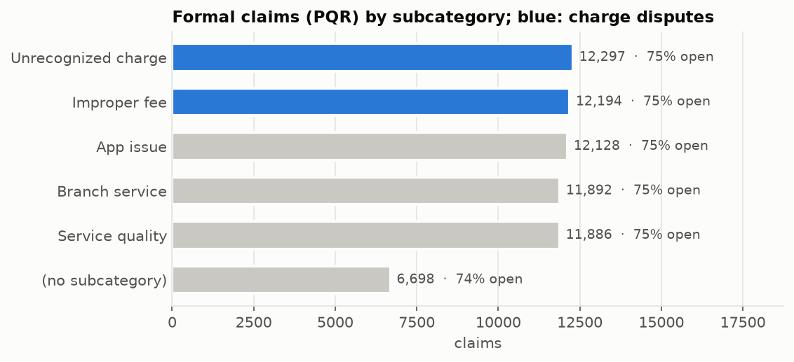
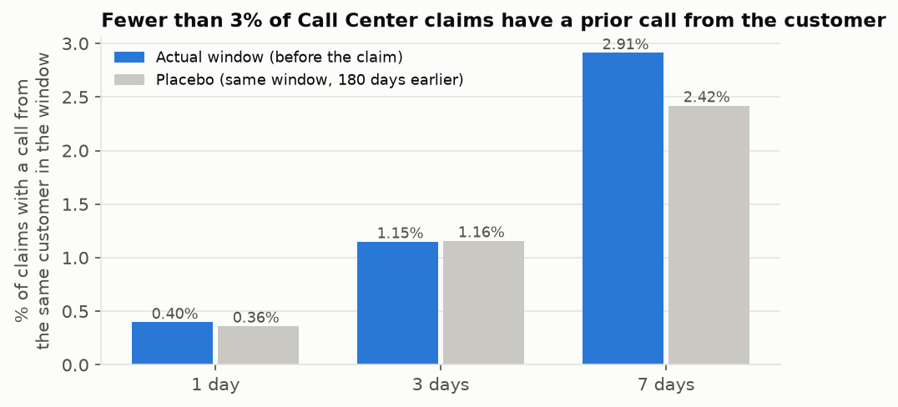
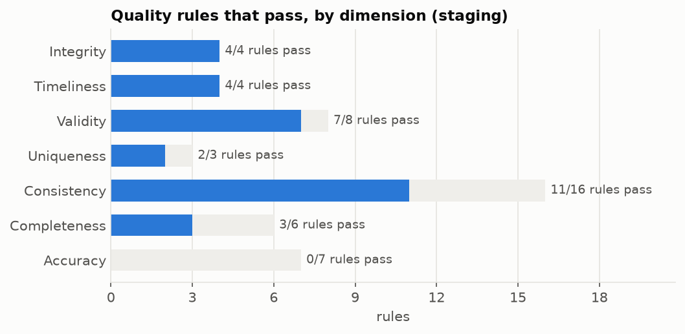

# Evidence for choosing the agent's workflow

> **A document for the team to decide with. It contains no decision.**
> Generated by `python -m pipelines.insights` on 2026-10-05T21:48:29+00:00. Source: `curated/` and `staging/`
> (synthetic LATAM Bank dataset v1.0.0, 3.0 years of contacts).
> Every figure is an **offline measurement on synthetic data**. Anything marked
> *inferred* or *projection* is not a measured fact.

## Summary (measured facts only)

1. **Complaints** is the contact reason with the most unresolved contacts: 41.2% of all unresolved contacts, with 17.1% of the volume (FCR 43.6%).
2. **Transactional** is the largest volume (35.0%), with FCR 91.5%.
3. Among formal claims (PQR), **charge disputes** are 40.6% (74.9% are still open).
4. **Calls and PQR claims cannot be linked**: 0.4% match vs 0.36% in the placebo window. We do not know which subcategory complaint calls have.
5. Transcripts and descriptions are **templates**: `detected_intents` is constant. The dataset's text labels cannot be used for training.
6. There are no significant differences by country, segment, channel or month. The signal is **only in the contact reason**.

---

## 1. Demand and pain by contact reason

| reason | contacts | pct_contacts | pct_handling_time | median_aht_s | fcr_pct | unresolved_contacts | followup_pct | csat_1to5 | sentiment | pct_unresolved |
|---|---|---|---|---|---|---|---|---|---|---|
| transactional | 240056 | 35.0 | 24.0 | 205.0 | 91.5 | 20385 | 22.1 | 2.91 | -0.0 | 12.7 |
| product | 150863 | 22.0 | 18.2 | 263.0 | 89.6 | 15650 | 23.8 | 2.9 | -0.037 | 9.8 |
| complaint | 117021 | 17.1 | 23.1 | 431.0 | 43.6 | 66000 | 63.0 | 2.43 | -0.067 | 41.2 |
| technical | 102899 | 15.0 | 16.8 | 360.0 | 69.9 | 30940 | 40.6 | 2.7 | -0.067 | 19.3 |
| commercial | 54879 | 8.0 | 13.4 | 540.0 | 65.2 | 19093 | 44.5 | 2.66 | -0.066 | 11.9 |
| retention | 20578 | 3.0 | 4.5 | 478.0 | 60.2 | 8198 | 49.1 | 2.61 | -0.065 | 5.1 |

- Pain metric: `contacts × (1 − FCR)` = unresolved demand. It is simple, auditable and does not depend on cost assumptions.
- `was_resolved` is self-reported. As a check, 7-day repeat contact is **not** higher for "unresolved" cases (0.49% vs 0.72% for resolved ones), so the accuracy of this label is doubtful (section 5).

## 2. Stability and fairness of the human baseline

| Check | Result | Reading |
|---|---|---|
| FCR gap between countries (worst gap within one reason) | 0.2 pp (product: CO n=45,564 vs MX n=75,351; z=1.0), within sampling noise | Fairness baseline by country |
| FCR gap between segments | 3.3 pp (retention: Premium n=2,064 vs Basic n=12,262; z=2.9), within sampling noise | Fairness baseline by segment |
| FCR gap between channels | 2.2 pp (technical: Email n=4,172 vs WhatsApp n=3,482; z=2.1), within sampling noise | There is no "winning channel" |
| Monthly volume variation (coefficient of variation) | 0.035 | Flat demand: no forecasting needed |
| Complaints per customer, with vs without fraud | 0.452 vs 0.447 | Fraud and complaints are independent |
| Agents who speak Portuguese | 129 of 1200 (10.8%) | Limited capacity to hand off to a person in PT |

## 3. Formal claims (PQR table)

| subcategory | complaints | pct | open_pct | sla_breached_pct | median_resolution_days | with_amount_pct |
|---|---|---|---|---|---|---|
| unrecognized_charge | 12297 | 18.3 | 74.6 | 20.4 | 15.0 | 33.3 |
| improper_fee | 12194 | 18.2 | 75.3 | 19.9 | 16.0 | 33.1 |
| app_issue | 12128 | 18.1 | 75.1 | 20.0 | 16.0 | 32.3 |
| branch_service | 11892 | 17.7 | 74.9 | 20.4 | 16.0 | 31.4 |
| service_quality | 11886 | 17.7 | 75.1 | 20.3 | 16.0 | 32.1 |
| (no subcategory) | 6698 | 10.0 | 74.3 | 19.3 | 16.0 | 32.1 |

- The PQR table **does not differ by subcategory**: SLA, times and backlog are almost identical. It is useful for sizing, not for prioritizing between subcategories.

## 4. Can we know what is inside "Complaint" calls?

**Not with this data.** Every route was tried:

| Link route | Result |
|---|---|
| `complaints.origin_interaction_id` | 100% empty (also in `data_backup_20260831/`) |
| The call's `contact_reason` | A copy of `reason_category` (6 values, no detail) |
| A call from the same customer before the claim | 1 day: 0.4% vs placebo 0.36%. Even at 7 days, fewer than 3% of claims have a prior call: not enough to link them |
| Transcript text | A template unrelated to the category |
| The call's `mentioned_products` | 99% non-existent IDs; none belong to the customer |
| `complaints.affected_product_id` | Never belongs to the customer who files the claim |

**Consequence:** saying "X% of complaint calls are disputes" would be an **inference**. Facts 1 and 3 of the summary are independent measurements and must not be multiplied together.

## 5. Data quality and fitness for each use

Detail of the 48 rules: [`data_quality.md`](data_quality.md).

| Use | Tables | Fit? | Evidence |
|---|---|---|---|
| Agent tools: transactions and products | transactions, products, customers | Yes, with caveats | Integrity and owner↔product and currency↔product consistency at 100%. Caveat: MX customers without MXN products and with a DNI |
| Prioritize by contact reason | call_center_interactions | Yes | Strong, stable signal by reason |
| Intent labels from transcripts | call_transcripts | **No** | `detected_intents` is constant; templates with unfilled `{monto}`; `main_topics` is a copy of the category |
| Claim text for NLP | complaints.description | **No** | 5 distinct texts in 67,095 claims |
| Link claim ↔ contact ↔ product | complaints | **No** | See section 4 |
| Resolution (`was_resolved`) as a success label | call_center_interactions | Doubtful | It does not predict repeat contact |

## 6. Options to decide

Each option separates what is **measured** from what would be **inferred**. All of them need a set labeled by the team (ES + PT) for the learned component, because the dataset has no useful text labels.

| | A. Charge disputes | B. Complaint intake and triage | C. Transaction inquiries | D. Technical support |
|---|---|---|---|---|
| **What the agent does** | Checks a charge, explains it or opens a dispute | Takes any complaint, classifies it, automates the verifiable disputes and hands off the rest with a summary | Balance, transactions, payment status | App or access problems |
| **Measured justification** | PQR: 40.6% are disputes | Calls: complaints = 41.2% of the unresolved | 35.0% of the volume | 19.3% of the unresolved (FCR 69.9%) |
| **Depends on something inferred** | Yes: that complaint calls are disputes | No | No | No |
| **Data for the tools** | transactions/products: fit | Same as A, plus a case record | transactions/products: fit | `digital_events` (3.7 GB) **not analyzed yet** |
| **Normal / ambiguous / human cases** | Natural | Natural, with more handoffs | Easy normal case; few human cases | To be evaluated |
| **Main risk** | Weak justification before the jury | Wider scope | Little "problem": it already resolves 91.5% | No data analyzed yet |
| **Contacts/year for the reason** | — | ~38,962 | ~79,927 | ~34,260 |

Projection (not measured, only for sizing): each FCR point gained on Complaints is ~389 fewer unresolved contacts per year.

## 7. Open questions for the team

1. Do we prioritize **quality** (the most unresolved reason: Complaints) or **volume/cost** (Transactional)?
2. Do we accept that A's justification depends on an inference, or do we prefer B, which only uses measured facts?
3. Do we analyze `digital_events` before deciding, to evaluate D properly?
4. Do we ask the organizers whether the empty `origin_interaction_id` is intentional or there is a corrected version?
5. How do we build the ES + PT labeled set (size, who labels, how we avoid leakage between paraphrases)?

## 8. Limitations

- Synthetic data: distributions are uniform except for the contact reason. The conclusions hold for this dataset, not for a real bank.
- The dataset has no Portuguese text. Everything in PT will be written by the team and documented as such.
- Not analyzed yet: `digital_events`, `campaign_sends`, `marketing_campaigns`.
