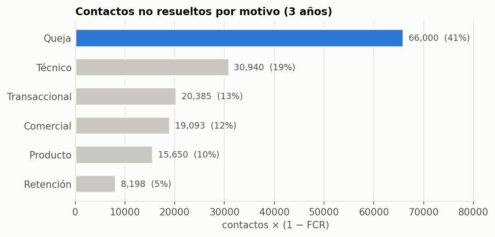
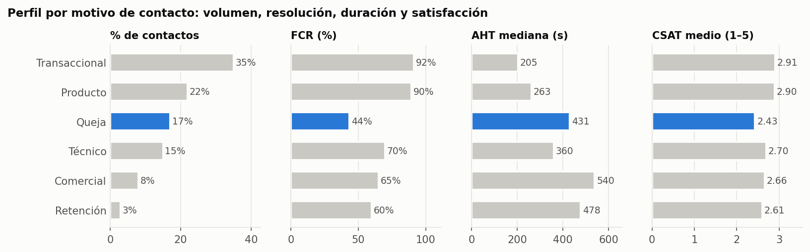
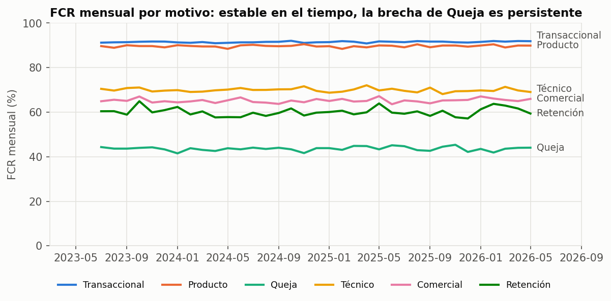
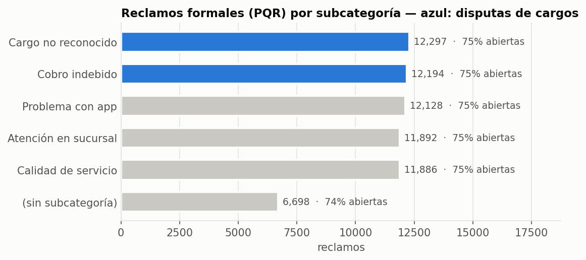
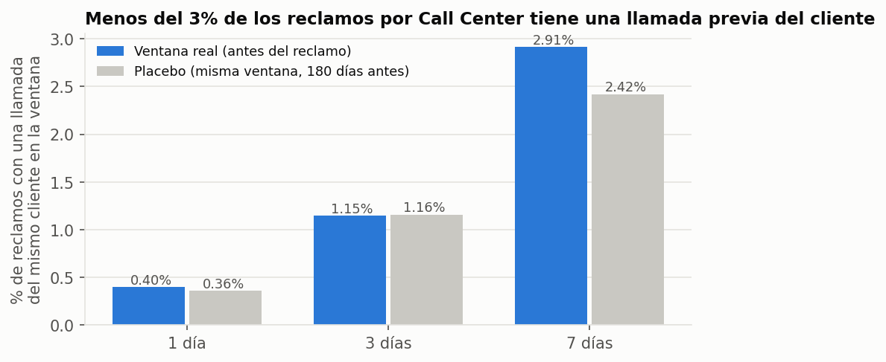
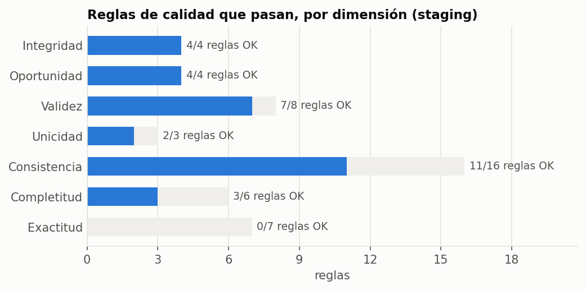

# Evidencia para elegir el flujo del agente

> **Documento para decidir en equipo. No contiene una decisión.**
> Generado por `python -m pipelines.insights` — 2026-09-26T15:03:06+00:00. Fuente: `curated/` y `staging/`
> (dataset sintético LATAM Bank v1.0.0, 3.0 años de contactos).
> Todas las cifras son **mediciones offline sobre datos sintéticos**. Lo marcado como
> *inferido* o *proyección* no es un dato medido.

## Resumen (solo hechos medidos)

1. **Quejas** es el motivo con más contactos no resueltos: 41.2% del total no resuelto, con 17.1% del volumen (FCR 43.6%).
2. **Transaccional** es el mayor volumen (35.0%), con FCR 91.5%.
3. En los reclamos formales (PQR), las **disputas de cargos** son el 40.6% (74.9% siguen abiertas).
4. **Las llamadas y los reclamos PQR no se pueden vincular**: coincidencia 0.4% vs 0.36% en la ventana placebo. No sabemos qué subcategoría tienen las llamadas de queja.
5. Las transcripciones y descripciones son **plantillas**: `detected_intents` es constante. Las etiquetas de texto del dataset no sirven para entrenar.
6. No hay diferencias significativas por país, segmento, canal ni mes. La señal está **solo en el motivo de contacto**.

---

## 1. Demanda y dolor por motivo de contacto

| motivo | contactos | pct_contactos | pct_tiempo_atencion | aht_mediana_s | fcr_pct | contactos_no_resueltos | seguimiento_pct | csat_1a5 | sentimiento | pct_no_resueltos |
|---|---|---|---|---|---|---|---|---|---|---|
| transactional | 240056 | 35.0 | 24.0 | 205.0 | 91.5 | 20385 | 22.1 | 2.91 | -0.0 | 12.7 |
| product | 150863 | 22.0 | 18.2 | 263.0 | 89.6 | 15650 | 23.8 | 2.9 | -0.037 | 9.8 |
| complaint | 117021 | 17.1 | 23.1 | 431.0 | 43.6 | 66000 | 63.0 | 2.43 | -0.067 | 41.2 |
| technical | 102899 | 15.0 | 16.8 | 360.0 | 69.9 | 30940 | 40.6 | 2.7 | -0.067 | 19.3 |
| commercial | 54879 | 8.0 | 13.4 | 540.0 | 65.2 | 19093 | 44.5 | 2.66 | -0.066 | 11.9 |
| retention | 20578 | 3.0 | 4.5 | 478.0 | 60.2 | 8198 | 49.1 | 2.61 | -0.065 | 5.1 |

- Métrica de dolor: `contactos × (1 − FCR)` = demanda no resuelta. Es simple, auditable y no depende de supuestos de costo.
- `was_resolved` es auto-reportado. Como control, el recontacto a 7 días **no** es mayor en los casos "no resueltos" (0.49% vs 0.72% en resueltos), así que la exactitud de esta etiqueta es dudosa (sección 5).

## 2. Estabilidad y equidad del baseline humano

| Chequeo | Resultado | Lectura |
|---|---|---|
| Brecha de FCR entre países (peor brecha dentro de un motivo) | 0.2 pp (product: CO n=45,564 vs MX n=75,351; z=1.0) — dentro del ruido muestral | Baseline de equidad por país |
| Brecha de FCR entre segmentos | 3.3 pp (retention: Premium n=2,064 vs Basic n=12,262; z=2.9) — dentro del ruido muestral | Baseline de equidad por segmento |
| Brecha de FCR entre canales | 2.2 pp (technical: Email n=4,172 vs WhatsApp n=3,482; z=2.1) — dentro del ruido muestral | No hay un "canal ganador" |
| Variación mensual del volumen (coef. de variación) | 0.035 | Demanda plana: no hace falta forecasting |
| Quejas por cliente, con vs sin fraude | 0.452 vs 0.447 | Fraude y quejas son independientes |
| Agentes que hablan portugués | 129 de 1200 (10.8%) | Capacidad limitada para derivar a humano en PT |

## 3. Reclamos formales (tabla PQR)

| subcategoria | quejas | pct | abiertas_pct | sla_incumplido_pct | dias_resolucion_mediana | con_monto_pct |
|---|---|---|---|---|---|---|
| unrecognized_charge | 12297 | 18.3 | 74.6 | 20.4 | 15.0 | 33.3 |
| improper_fee | 12194 | 18.2 | 75.3 | 19.9 | 16.0 | 33.1 |
| app_issue | 12128 | 18.1 | 75.1 | 20.0 | 16.0 | 32.3 |
| branch_service | 11892 | 17.7 | 74.9 | 20.4 | 16.0 | 31.4 |
| service_quality | 11886 | 17.7 | 75.1 | 20.3 | 16.0 | 32.1 |
| (sin subcategoría) | 6698 | 10.0 | 74.3 | 19.3 | 16.0 | 32.1 |

- La tabla PQR **no diferencia por subcategoría**: SLA, tiempos y backlog son casi idénticos. Sirve para dimensionar, no para priorizar entre subcategorías.

## 4. ¿Podemos saber qué hay dentro de las llamadas de "Queja"?

**No con estos datos.** Se probaron todas las vías:

| Vía de vínculo | Resultado |
|---|---|
| `complaints.origin_interaction_id` | 100% vacío (también en `data_backup_20260831/`) |
| `contact_reason` de la llamada | Es una copia de `reason_category` (6 valores, sin detalle) |
| Llamada del mismo cliente antes del reclamo | 1 día: 0.4% vs placebo 0.36%. Aun a 7 días, menos del 3% de los reclamos tiene una llamada previa: no alcanza para vincular |
| Texto de la transcripción | Plantilla sin relación con la categoría |
| `mentioned_products` de la llamada | 99% IDs inexistentes; ninguno del cliente |
| `complaints.affected_product_id` | Nunca pertenece al cliente que reclama |

**Consecuencia:** afirmar que "X% de las llamadas de queja son disputas" sería una **inferencia**. Los hechos 1 y 3 del resumen son mediciones independientes que no deben multiplicarse entre sí.

## 5. Calidad de datos y aptitud para cada uso

Detalle de las 48 reglas: [`data_quality.md`](data_quality.md).

| Uso | Tablas | ¿Apto? | Evidencia |
|---|---|---|---|
| Herramientas del agente: movimientos y productos | transactions, products, customers | Sí, con salvedades | Integridad y consistencia dueño↔producto y moneda↔producto al 100%. Salvedad: clientes MX sin productos en MXN y con DNI |
| Priorizar por motivo de contacto | call_center_interactions | Sí | Señal fuerte y estable por motivo |
| Etiquetas de intención desde transcripciones | call_transcripts | **No** | `detected_intents` constante; plantillas con `{monto}` sin rellenar; `main_topics` es copia de la categoría |
| Texto de reclamos para NLP | complaints.description | **No** | 5 textos distintos en 67,095 reclamos |
| Vincular reclamo ↔ contacto ↔ producto | complaints | **No** | Ver sección 4 |
| Resolución (`was_resolved`) como etiqueta de éxito | call_center_interactions | Dudoso | No predice recontacto |

## 6. Opciones para decidir

Cada opción separa lo que está **medido** de lo que sería **inferido**. Todas requieren un set etiquetado por el equipo (ES + PT) para el componente aprendido, porque el dataset no tiene etiquetas de texto útiles.

| | A. Disputas de cargos | B. Intake y triage de quejas | C. Consultas transaccionales | D. Soporte técnico |
|---|---|---|---|---|
| **Qué hace el agente** | Verifica un cargo, lo explica o abre una disputa | Atiende cualquier queja, la clasifica, automatiza las disputas verificables y deriva el resto con resumen | Saldo, movimientos, estado de pagos | Problemas de app o acceso |
| **Justificación medida** | PQR: 40.6% son disputas | Llamadas: quejas = 41.2% de lo no resuelto | 35.0% del volumen | 19.3% de lo no resuelto (FCR 69.9%) |
| **Depende de algo inferido** | Sí: que las llamadas de queja sean disputas | No | No | No |
| **Datos para las herramientas** | transactions/products: aptos | Igual que A, más registro de caso | transactions/products: aptos | `digital_events` (3,7 GB) **aún no analizado** |
| **Casos normal / ambiguo / humano** | Natural | Natural, con más derivaciones | Normal fácil; pocos casos de humano | Por evaluar |
| **Riesgo principal** | Justificación débil ante el jurado | Alcance más amplio | Poco "problema": ya resuelve 91.5% | Sin datos analizados todavía |
| **Contactos/año del motivo** | — | ~38,962 | ~79,927 | ~34,260 |

Proyección (no medida, solo para dimensionar): cada punto de FCR ganado en Queja equivale a ~389 contactos/año menos sin resolver.

## 7. Preguntas abiertas para el equipo

1. ¿Priorizamos **calidad** (el motivo más no resuelto: Queja) o **volumen/costo** (Transaccional)?
2. ¿Aceptamos que la justificación de A dependa de una inferencia, o preferimos B, que solo usa hechos medidos?
3. ¿Analizamos `digital_events` antes de decidir, para evaluar bien D?
4. ¿Preguntamos a los organizadores si `origin_interaction_id` vacío es intencional o hay una versión corregida?
5. ¿Cómo generamos el set etiquetado ES + PT (tamaño, quién etiqueta, cómo evitamos fuga entre paráfrasis)?

## 8. Limitaciones

- Datos sintéticos: las distribuciones son uniformes salvo por el motivo de contacto. Las conclusiones valen para este dataset, no para un banco real.
- No hay texto en portugués en el dataset. Todo lo PT será generado por el equipo y se documentará así.
- No analizados aún: `digital_events`, `campaign_sends`, `marketing_campaigns`.
