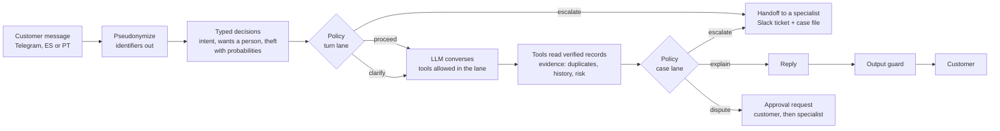

# How Lir works, and why each model

This page explains how Lir decides what to do with a customer who says *"I don't recognize this
charge"*, which model does each job and why, and how every claim is measured. Every number
links to the report that produced it; the reports are generated by code in this repository.

## 1. Why this workflow

The organizers' LATAM Bank dataset (synthetic, 3 years of contacts) points to the same place
from two independent measurements ([`insights.md`](../../data/reports/insights.md)):

| Measurement | Result |
|---|---|
| Contacts left unresolved, by reason | **Complaints: 41.2%** of all unresolved contacts, with 17.1% of the volume (first-contact resolution 43.6%) |
| Formal claims (PQR) by subcategory | **Charge disputes: 40.6%**, and 74.9% of them are still open |

The two figures are kept apart on purpose: the data cannot link a call to a formal claim (the
link field is empty and every other join is no better than chance), so we never multiply them.
The data was also checked before building on it: 48 quality rules
([`data_quality.md`](../../data/reports/data_quality.md)) confirm the tables the agent's tools read
(transactions, products, customers) and rule out the free-text fields, which are templates.

## 2. How one message is decided

1. **The customer's words are pseudonymized** before any model reads them: card, account,
   document and contact numbers are removed, and bank records travel as placeholders such as
   `[[COMERCIO_1]]` that the service resolves before the customer reads the reply
   ([`privacy.md`](../security/privacy.md)).
2. **A typed decision layer classifies the message** with three closed questions, each with a
   probability: the intent (5 classes), whether the customer wants a person, and whether theft
   is suspected.
3. **A versioned policy picks the turn lane** from those probabilities and the form's answers
   (`resources/policy.yaml`): proceed, clarify, escalate, or review a rejected explanation. The
   lane decides which tools the LLM may call in that turn.
4. **The LLM converses and calls tools.** Tools read verified records only, and return evidence
   (duplicates, the merchant's history with the customer, the fraud score, the country).
5. **The policy picks the case lane** from that evidence: explain the charge, propose a dispute,
   or escalate. The LLM never decides this.
6. **Nothing that changes an account runs without people.** A dispute becomes an approval
   request: the customer approves it on a signed-in web card, then a specialist approves or
   rejects it in the back office. Escalated cases go to a specialist with a case file built from
   verified facts, and the specialist accepts or rejects the claim. The customer hears every
   outcome in their chat.
7. **A deterministic output guard checks every reply** and replaces any that promises or claims a
   refund, says a card was frozen, or asks for a credential.

## 3. The models, and why each one

| Job | Model | Why this one |
|---|---|---|
| Converse with the customer and call tools | **OpenAI `gpt-4o`** through LiteLLM | Reliable tool calling and fluent Spanish and Portuguese. LiteLLM keeps it swappable by configuration (`LLM_MODEL`); it only sees pseudonymized data. |
| Classify each message (typed decisions) | **Keyword baseline**, **Jev** (TypeSafe AI) or an **LLM**, by configuration | Decisions are kept out of the conversation model so each one has a probability, a threshold in the policy, a measurable accuracy and an audit trail. See §4. |
| Choose what the agent may do | **No model: a versioned YAML policy** | Rules a bank can read, version and audit. The same input always gives the same lane, and every turn records which rule fired. |
| Transcribe Telegram voice notes | **Google Cloud Speech-to-Text** | Managed, no audio leaves Google Cloud, and it supports `es-US` and `pt-BR`. Off unless `SPEECH_TO_TEXT=google`. |

## 4. The decision models, measured

The decision layer was evaluated against labels, as the bases require (§4: *"evaluate at least
one learned component against an appropriate baseline"*). Full report, with calibration,
per-class F1, error analysis and thresholds: [`decision_eval.md`](../../data/reports/decision_eval.md).

**Data:** 320 messages written by the team (Spanish, Portuguese and portuñol, with negations,
slang and figurative "theft"), 4 paraphrases per seed, **split by seed** so no paraphrase leaks
into the test set. Thresholds are chosen on validation only; the test set (160) is reported once.

| Candidate | Intent accuracy [95% CI] | Decides alone / right when it does (policy threshold) | p50 latency |
|---|---|---|---|
| Keyword baseline | 44.4% [30-60] | 31.2% / 94.0% | <1 ms |
| LLM (structured output) | 97.5% [86-99] | 100% / 96.9% | 2.1 s |
| **Jev** (OpenRouter `typesafe/jev-router`) | **97.1% [88-100]** | **100% / 98.1%** | 3.1 s |

- **The baseline is safe but narrow:** it is right 94% of the time when it decides, but it only
  decides 31% of messages; the rest fall to "clarify", where the agent asks again.
- **Jev and the LLM are equivalent** with this data (their intervals overlap), and both are far
  above the baseline. Jev was built for typed decisions and costs a fraction of a cent per
  message.
- **The policy thresholds hold:** "wants a person" (0.50) and "theft suspected" (0.30) fall inside
  the valid range for both Jev and the LLM.
- **Fair across languages:** no significant difference between Spanish, Portuguese and portuñol
  for any candidate.

The production decision model is set with `DECISIONS` and `DECISION_LLM_MODEL`; the keyword
baseline always stays last in the chain, so a model outage degrades to it instead of failing.

## 5. How the rest is tested

| What | How | Where |
|---|---|---|
| Code | 479 unit and integration tests, plus ruff and pyright | `scripts/check.sh` |
| The whole agent | 35 scenario tasks from the jobs to be done (identify and explain, merchantless charges, disputes, asking for a person, security, failures, scope), graded on outcome, safety, grounding and language, with pass^k over repeated trials | [`app/evals/`](../../app/evals/README.md) |
| Typed decisions | 320 labeled messages against a baseline | [`decision_eval.md`](../../data/reports/decision_eval.md) |
| The data | 48 quality rules over contracts per table | [`data_quality.md`](../../data/reports/data_quality.md) |
| Production | Every step audited into BigQuery and charted in Looker Studio | [`looker-studio.md`](../analytics/looker-studio.md) |

A real failure shaped the guard: in a production test the model told a customer a refund had
been generated, with no tool call and no approval behind it. The output guard only caught
promises, not claims; it now blocks both, and the case is a regression test.

## 6. Reports in this repository

| Report | What it answers |
|---|---|
| [`data/reports/insights.md`](../../data/reports/insights.md) | Which workflow to build, from measured evidence |
| [`data/reports/data_quality.md`](../../data/reports/data_quality.md) | Which tables and fields can be trusted, and for what |
| [`data/reports/decision_eval.md`](../../data/reports/decision_eval.md) | How well each decision model classifies, against labels |
| [`docs/privacy.md`](../security/privacy.md) | What leaves the perimeter, to whom, and the residual risk |
| [`docs/architecture/case-flow.md`](../architecture/case-flow.md) | How a case flows from the form to Telegram |
| [`docs/analytics/looker-studio.md`](../analytics/looker-studio.md) | The BigQuery views behind the dashboards |
